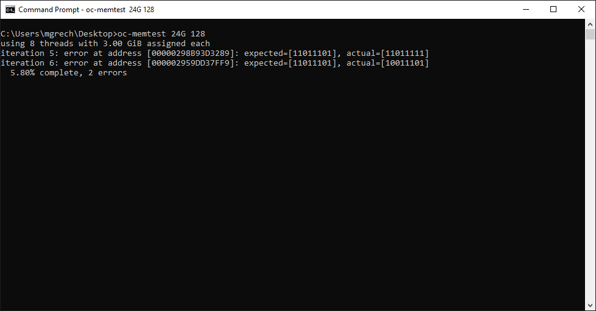

# oc-memtest
Windows tool for testing memory overclock stability

Usage: oc-memtest &lt;memory&gt; &lt;iterations&gt;
- memory: Amount of memory to test, supported suffixes are K, M, G, T.
- iterations: Number of passes over the memory.

To prevent Windows from interfering by paging memory to disk, assign the SeLockMemoryPrivilege to your Windows account during testing, see [here](https://docs.microsoft.com/en-us/windows/security/threat-protection/security-policy-settings/lock-pages-in-memory) on how to do this. oc-memtest spits out a warning when locking memory fails.
